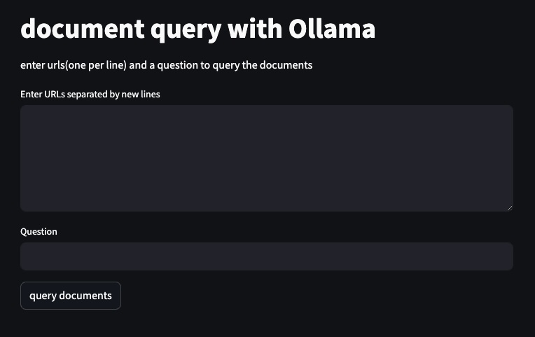

[教學](http://intervalrain.github.io/genai/naiverag/)

Fork and then 執行
```
streamlit run app.py
```

步驟：
1. 載入文件
2. 分割文件
3. 選擇 embedding 模型
4. 創建向量資料庫
5. 建立 Retriever Interface
6. 執行 RAG
7. 查詢

Further Work:
+ MetaData Filtering
+ Pre/Post Retrieval
+ Rerank
+ Advanced RAG/Graph RAG